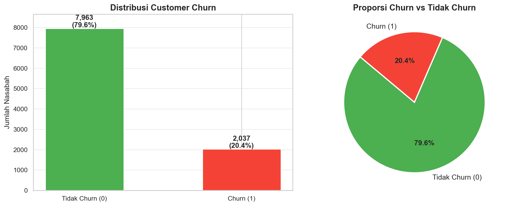
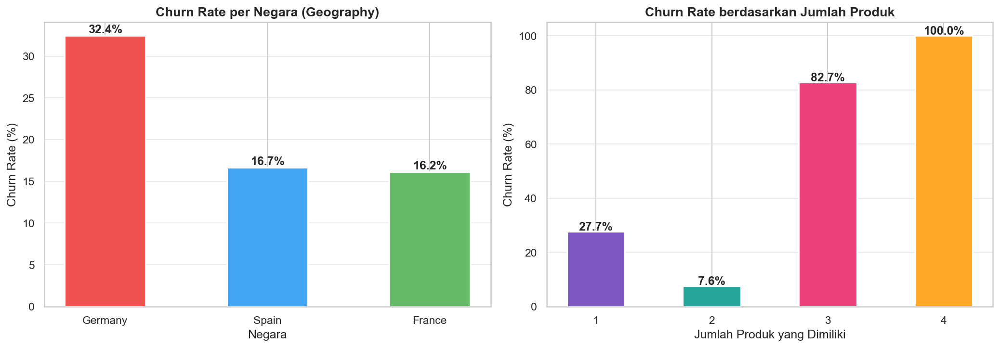
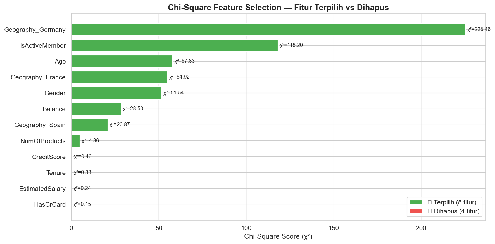
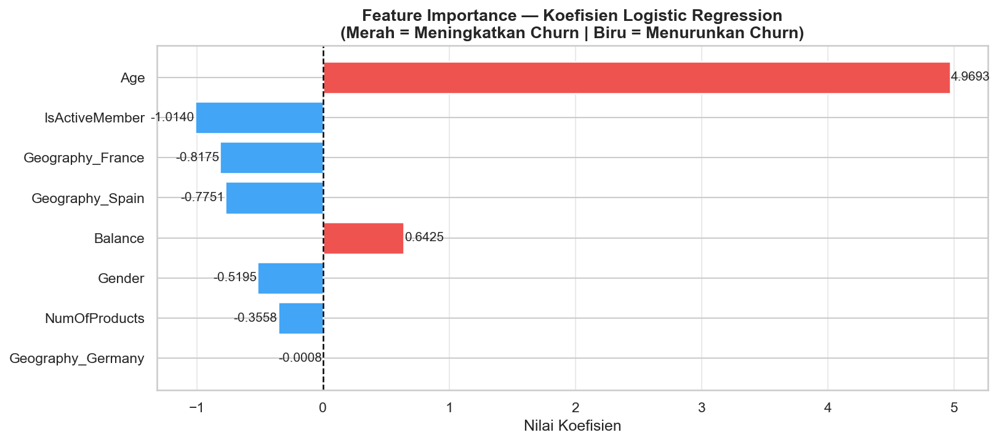
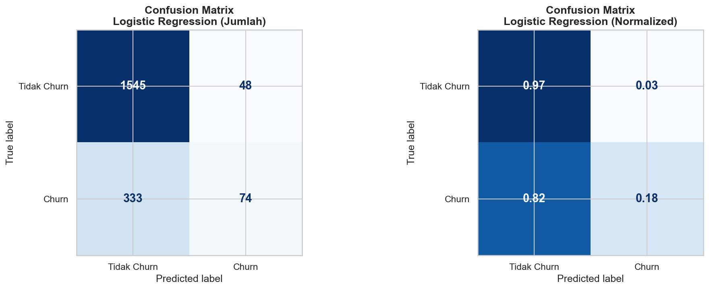

# Bank Customer Churn Prediction 🏦


## 📌 Project Overview
This project aims to predict bank customer churn (whether a customer will close their account or not) using **Supervised Machine Learning**. We build a **Logistic Regression** model and employ techniques like **Chi-Square Feature Selection** and **Principal Component Analysis (PCA)** to find the most significant indicators of customer attrition.

This repository serves as a complete Data Mining end-to-end pipeline, ranging from Exploratory Data Analysis (EDA) to Model Interpretation.

## 📂 Project Structure
```text
.
├── dataset/
│   └── churn.csv                  # The Bank Customer Churn dataset
├── images/                        # EDA and Model evaluation plots
├── churn_prediction_logistic_regression.ipynb  # Main Jupyter Notebook
├── requirements.txt               # Dependencies
└── README.md                      # Project documentation
```

## 📊 Key Insights & Exploratory Data Analysis
During our EDA, we discovered several interesting patterns among the bank customers:

- **Geography matters:** Customers from **Germany** have a significantly higher churn rate (~32%) compared to France and Spain.
- **Active Members are Loyal:** Inactive members have an almost 2x higher churn rate (~26.9%) compared to active members (~14.3%).
- **Product Sweet Spot:** Customers with **2 products** are the most loyal, whereas customers with **4 products** have a nearly 100% churn rate!
- **Age:** Older customers (median ~45 years) are more prone to churn compared to younger ones.

### Distribution of Churn


### Churn Rate by Geography & Number of Products


## 🔬 Feature Selection & Dimensionality Reduction
To improve model interpretability and reduce noise, we employed statistical testing:
- **Chi-Square (χ²):** We identified **8 highly significant features** out of 12 (e.g., `Geography_Germany`, `IsActiveMember`, `Age`, `NumOfProducts`). Non-significant features like `CreditScore` and `Tenure` were dropped.
- **PCA:** We also experimented with PCA, reducing the dimensionality into 10 Principal Components while maintaining ≥90% variance, though the Chi-Square selected features provided better interpretability.



## 🤖 Modeling & Evaluation
We compared multiple approaches:
1. **Logistic Regression (8 Chi-Square Features) - ✨ Main Model**
2. **Decision Tree (8 Chi-Square Features)**
3. **Logistic Regression (10 PCA Components)**

**Results:**
Our main **Logistic Regression** model achieved an accuracy of **~81%**. We chose Logistic Regression over Decision Tree because of its high interpretability in a business context. 

### Model Coefficients (Feature Importance)

*Red bars increase churn probability, while blue bars decrease it.*

### Confusion Matrix


## 🚀 How to Run Locally

1. **Clone the repository:**
   ```bash
   git clone <your-github-repo-url>
   cd "Projek Data Mining"
   ```
2. **Install dependencies:**
   ```bash
   pip install -r requirements.txt
   ```
3. **Run the Notebook:**
   ```bash
   jupyter notebook churn_prediction_logistic_regression.ipynb
   ```

## 📜 License
This project is licensed under the MIT License. Feel free to use and learn from this repository!
